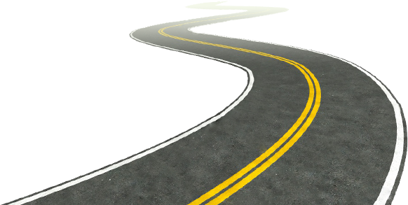
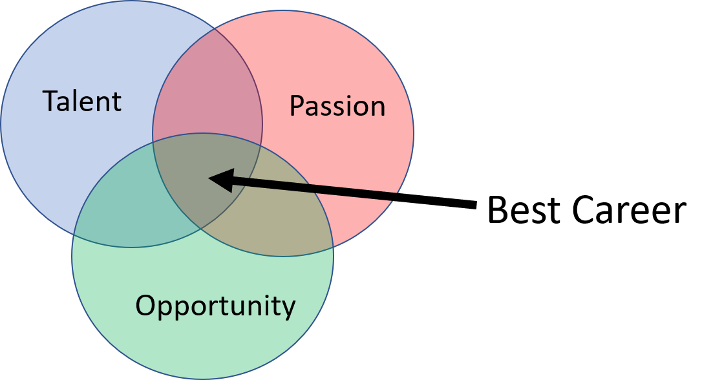

<!--- START PAGINATE FEATURE --->

"<em>If you don't know where you are going, you might wind up someplace else</em>" --Yogi Berra

This post continues from the introduction which can be found here: [Don't Wait to Have Your Best Career](https://kljohnson.netlify.app/2022/09/04/dont-wait-to-have-your-best-career/).  It introduces a procedural methodology to create a career development plan so that you can obtain your version of a successful career.

The journey is comprised of these steps:
1. <a href="#" class="page2">Build Your Compass: Know Thyself</a>
2. <a href="#" class="page3">Understand The Landscape</a>
3. <a href="#" class="page4">Map Orientation</a>
4. <a href="#" class="page5">Choose Your Destination</a>
5. <a href="#" class="page6">Locate Your Starting Point</a>
6. <a href="#" class="page7">Plan Your Route</a>
7. <a href="#" class="page8">Get Moving</a>
8. <a href="#" class="page9">Reflect. Repeat</a>

I suggest you read through all the steps first, then circle back to spend a bit more time on the exercises in each step.

You can download [Career Development Worksheet.docx](https://github.com/kljohnson4good/Blog/blob/main/Career%20Development%20Worksheet.docx) from the github site to jot down your responses for each exercise.  By the end you'll have a tool for meaningful conversations with your boss/manager and/or mentor. 

### Attribution:

* Image: <a href="https://www.freepnglogos.com/pics/road">Road from freepnglogos.com</a>

<!--- #################### STEP 1 ########################### --->

# Step 1: Build Your Compass (Know Thyself)

 
  
 "<em>Knowing yourself is the beginning of all wisdom</em>" --Aristotle

Try not to be guided by somebody elses version of success.  Find yourself first.

### Values

Your journey should be guided by your values. Otherwise too many years later you could realize you've been wasting your time on the wrong things.  By using your values as a compass you are better poised to spend your precious time on this earth doing things that bring you fulfillment and joy as opposed to misguided frustration. 

**Use the worksheet to come up with a list of your top 5 values in priority order**.  If you're having a difficult time coming up with these, then you're not alone.  Trust me, it's hard to figure out who you are and why you want what you want.  It's been a continual process for me over 30 years!  However once you start this process, your clarity will emerge year after year.

Use the worksheet and brainstorm these things:
1. What experiences fulfill you and bring you joy and happiness?  
2. Who your role models and why?  What is it about them that you admire and seek to amplify in yourself?
3. Dig deeper into the WHY behind your current goals.  For example if you want to be rich, what is it about being rich that you really want?  Is it freedom, admiration, power, etc?

What values are behind the theme of your responses?  You may want to stop here and research more about values or even take an assessment to help you understand yourself and what motivates you.  If you already have a good handle on who you are, then go on to the next step.

example: My values at the time of writing:

1. Healthy (non-toxic) work environment
2. Work/life balance and office flexibility
3. Opportunities for new and unique experiences (conferences, roles, tasks, learning etc)
4. Freedom and autonomy for what I work on and how I achieve set objectives
5. Size of paycheck

### Passion

Finding a career that can tap into your passion will boost your career because you'll be able to spend that little extra discretionary time you might have on it, and won't drain your energy.  In fact, doing these things might even boost your energy and help you bring the best version of yourself not only to work but into other areas of your personal life.

**Use the worksheet to identify your top 3-5 passions**.

Passions are things you like doing, have an affinity to do and would probably even do them for free.  It's helpful to think about where you spend the bulk of your time or thoughts when they are NOT chores (things you don't simply feel obligated to do) or physical restoration (i.e. sleep).  For me, passions are the things I stay up to midnight for despite being sleepy.  I wake up thinking about them night, and can't wait to get out of the bed in the morning to do.  Passion projects create energy in my life.  

* List experiences you've had which gave you energy or made you feel excited
* What do you do for fun in your "me time"?

### Attribution:

* Photo by Hassan OUAJBIR: https://www.pexels.com/photo/woman-sitting-while-showing-heart-sign-hands-1535288/

<!--- #################### STEP 2 ########################### --->

# Step 2: Understand The Landscape

  

Knowing landscape helps you see which routes will be easier and which will be more difficult (or impossible) to traverse.  The TOP model is popular and can easily be Googled to get more details.  TOP stands for: **Talent**, **Opportunity** and **Passion**.  The concept is that when the 3 intersect, this is where you can have your best career.  

  

### Talent (strengths)

These are skills that you've focused on during school or mastered on the job.  They might be things that come naturally easy to you or things that you've worked on to the point that you are now really good at doing.

It may sometimes be difficult to notice your own strengths because they come so naturally to you and feel easy.  If you find yourself wondering why nobody else can do what you do because it's so intuitive or easy, then take special note because these are **your superpowers**.

If you're having trouble defining your talents then it may help to get feedback from your manager, mentor, colleagues or friends.  There are also free assessments you can take online [https://www.viacharacter.org/](https://www.viacharacter.org/) (one I took), or more detailed assessments you can pay for like [StrengthsFinder](https://www.gallup.com/cliftonstrengths/en/254033/strengthsfinder.aspx).

**Use the worksheet to write down your talents**.

### Opportunity

The opportunities available to you are going to be restricted by the industry, company you and particular team you're in. If you haven't done so already, have a discussion with to your manager about what opportunities are available which may align with your talents, passions and goals.  Note further to **align opportunities with business objectives for maximum impact**. The more you understand about the big picture company objectives, the more potential you have to add value.  When you add value, you gain leverage to negotiate for the things you want.

Not all managers are the same when it comes to helping you on your journey.  To help yourself more, you may also want to research how to **Job Craft** your role in a way that helps you get closer to what you're looking for. 

**Use the worksheet to write down the available opportunities** as they relate to your current condition.  For example is there a need that needs to be filled that you can volunteer to help out with.

### Changing the Landscape

The landscape is not static!  Adopt a **growth mindset**, to believe that anything is possible.  Values and passions are probably going to be immutable properties but you have control over your talent and can influence the opportunities.

For example if you complete your TOP model Venn diagram and realize that the intersection doesn't align with your income needs, then you may need to change your skillset by working on mastering a particular skill or acquiring a certificate.  Likewise if your opportunities don't align then you may need to look into changing your role, company or industry.

### Attribution

* Photo by Matheus Bertelli: https://www.pexels.com/photo/off-road-car-driving-in-difficult-terrain-11749418/

<!--- #################### STEP 3 ########################### --->

# Step 3: Map Orientation

The map is defined by your company and your boss. They will define the paths and requirements to upward mobility. 

  

 For example a company may have grade levels (ex: Engineer grade level I, II, III) or may simply use titles like "junior", "senior", "lead", "fellow", etc.  Each typically come with financial and/or prestige related incentives and will likely be how you end up defining progress or setting short-term goals.  

Some companies like mine have a pretty well defined map, but others don't.  If your company or team has not created this for you, then you may have to do a little extra work to create one for yourself.  Having something well defined will help keep mutual expectations between you and your manager and help to hold your superiors accountable when it comes time for those promotion discussions.  Maps aren't guarantees or checkboxes to promotions but they will help you collect the evidence necessary to expedite it.

If you have not done so yet, have a discussion with your manager, mentor and/or colleagues to make sure you understand what the map is, and which way is up, down or sideways.  You should also seek to understand what it *actually* takes to move around on the map as well.

<!--- #################### STEP 4 ########################### --->

# Step 4: Choose Your Destination

It's *Choose You're Own Adventure* time.  How far you want to go?

  

<em>Great things never come from comfort zones</em>

### Lifelong Goals

**Use the worksheet to write down lifelong goals**.  These long-term goals may be a goal 10+ years down the line, when you retire, or even what you want to achieve before you die, or how you want to be remembered when you die.  

Be inspirational.  The goal might feel impossible right now but this plan is being written to take those steps.  Try not to worry about whether you achieve it or not either.  A moonshot could be made by aiming for the stars, and that's still pretty remarkable.

"<em>If you aim higher than you expect, you could reach higher than you dreamed</em>" --Richard Branson

**Come back to your values**.  Remember to connect your goals to your values.  Do they align?  Why do you want this particular goal?  I know sometimes we get caught up in the rat race or neighbor comparison game, but note that not every goal is achieved through leveling up or being promoted.  

### Short-Term Goals

**Use the worksheet to write down short term goals**.

Break the larger goals into smaller goals until you identify something that is achievable in the next 1-4 years.  These goals will be limited by your landscape and map given your current situation.

example:

* **Life Goal**: Become the best version of myself so that I can inspire others to be the best version of themselves
* **Career Goal**: Promotion every 3-5 years and/or I successfully inspire others.
* **Next Destination**: Promotion within 2 years

### Commit And Share Your Goals

Writing down your goals can support your commitment to them.  Now let them be known to enable others to help you get what you want.  Your manager, mentors and leaders are all people who are typically in a position to hear about opportunities before you do.  They also have influence over who is assigned to do what tasks, so they are key factors in helping you get to where you want to go. When people know what you want and what talent you can offer, you'll be top of mind when opportunities open up.  One piece of advice that sticks with me to today is that people cannot read your mind.  You cannot expect people to know what you want, so be vocal.  Say it, and repeat it, and  make sure you're heard.  Communicating openly and transparently will uncover hidden opportunities in the landscape.

<!--- #################### STEP 5 ########################### --->

# Step 5: Locate Your Starting Point On The Map
Your strengths define your starting point.  Locate them on the map.

  

For example which grade level or title are you performing to right now?  
If you've created or located a well defined map in the previous steps, then you can use it to check off areas you are doing well and identify areas you need to improve upon which will help plan your route in the next step.

Always stay aligned with your manager.  I suggest you have a meaningful conversation with your manager to ensure you are on the same page because they will be your gatekeeper to upwards mobility in your company.  Note further that each person is unique.  Even managers in the same organizational hierarchy will have different expectations, and further expectations for a peer of yours working for the same manager may not be transferable to you.

<!--- #################### STEP 6 ########################### --->

### Step 6: Plan Your Route

  

Now that you have a destination in mind and know where you're starting from, it's time to plan the route  and waypoints.  Think of the waypoints as micro-goals (or stepping stones) along your way to achieving your goals.  It's best if they are specific, time bound and measurable.  What do you want, by when, as measured by what?  Without those details, it becomes too easy to let yourself off the hook.  For example, of you want to become an an *expert* in python coding, what does it mean to be an expert?  Instead, define expert as for example, passing a particular skills test (like LinkedIn skills tests).

**Use the worksheet to plan waypoints between your location and next destination**.

example:

* **Next Destination**: Promoted in next 2 years
    
    * **Waypoint 1**:Become an expert at programming in python by the end of the year, as measured by passing the Linked-In skills test
    * **Waypoint 2**: Become a confident presenter as measured by my manager
    

### A Note About Progress

Progress is not always a straight line.  Many people will tell you that the path was winding.  The point is to keep moving and beware of stagnation.

"<em>Without deviation from the norm, progress is not possible</em>" --Frank Zappa

  

Sometimes by simply following your compass (doing things that bring your fulfillment, joy and happiness), eventually your path reveals itself.

  

"<em>You can't connect the dots looking forward; you can only connect them looking backwards.  So you have to trust that the dots will somehow connect in your future</em>" --Steve Jobs

 
Trust in the journey and try not to worry too much about the destination.

<!--- #################### STEP 7 ########################### --->

### Step 7: Get Moving
<iframe style="float: left; padding-right:10px" src="https://assets.pinterest.com/ext/embed.html?id=611082243180070377" height="258" width="236" frameborder="0" scrolling="no" ></iframe>

Break the waypoints into actionable steps.  Again suppose so you want to be an expert python coder.  How does one achieve that?  Brainstorm a list of options such as taking a class or reading a book.  Prioritize the list then go do some research to define which specific class or book, and schedule some time in whatever calendar runs your life and go do it!

**Use the worksheet to identify actions that move you towards the waypoints**

example:

* **Next Destination**: Promoted in next 2 years
    * **Waypoint 1**:Become an expert at programming in python by the end of the year, as measured by passing the Linked-In skills test
    
        * **Action 1**: Schedule 2 hours per week on my calendar to find a class and complete all the exercises
    
    * **Waypoint 2**: Become a confident presenter as measured by my manager
    
        * **Action 2.1**: Schedule an hour a week to attend my local Toastmasters club meeting
        * **Action 2.2**: Schedule a meeting with my manager to discuss opportunities to volunteer to present technical information in an upcoming meeting
    

# Reflect.  Repeat.

Congratulations!  If you've gotten this far, then you have a good start on planning your career journey.  But it doesn't end here, nor does it stop once you reach a destination.  

Remember that your plan is not a contract.  It's OK if you don't do everything on the list or don't execute them exactly as planned.  During your reflection time, also record unplanned events or achievements.  These are important waypoints that may help you to see the path and opportunities as it reveals itself.

This process should be repeated regularly because your personal values and goals will change over time, not to mention the landscape and map may as well. 

example: My personal method leverages new years as an annual checkpoint to reflect on my bigger aspirations in a binder as well as record unexpected achievements that occurred during the year.  Then my quarterly work related review sessions with my manager serve to remind me to double check the plan against my current situation.

<!--- #################### end of content ########################### 

<b>Steps: 
<a href="#" class="page1">Intro</a>
<a href="#" class="page2">1</a>
<a href="#" class="page3">2</a>
<a href="#" class="page4">3</a>
<a href="#" class="page5">4</a>
<a href="#" class="page6">5</a>
<a href="#" class="page7">6</a>
<a href="#" class="page8">7</a>
</b>
--->

<b>Navigation: 
<a href="#" class="page1">Intro</a>
1. <a href="#" class="page2">Build Your Compass</a>
2. <a href="#" class="page3">Understand The Landscape</a>
3. <a href="#" class="page4">Map Orientation</a>
4. <a href="#" class="page5">Choose Your Destination</a>
5. <a href="#" class="page6">Locate Your Starting Point</a>
6. <a href="#" class="page7">Plan Your Route</a>
7. <a href="#" class="page8">Get Moving</a>
7. <a href="#" class="page9">Reflect</a>
</b>

<!--- END PAGINATE FEATURE --->