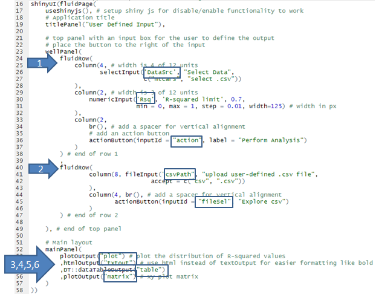
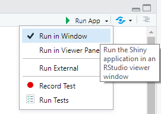
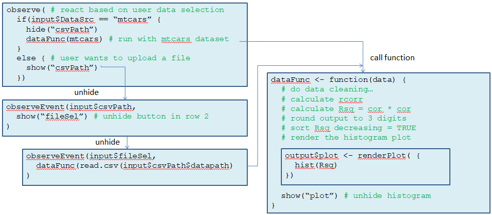
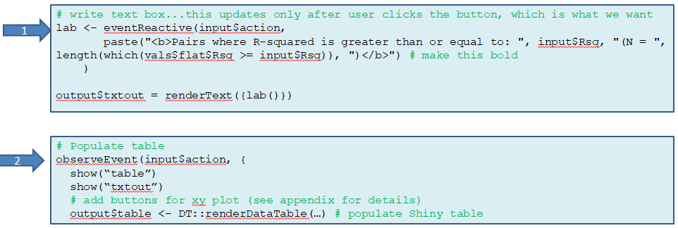
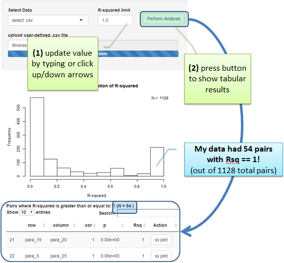
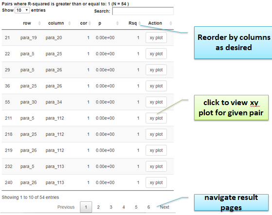
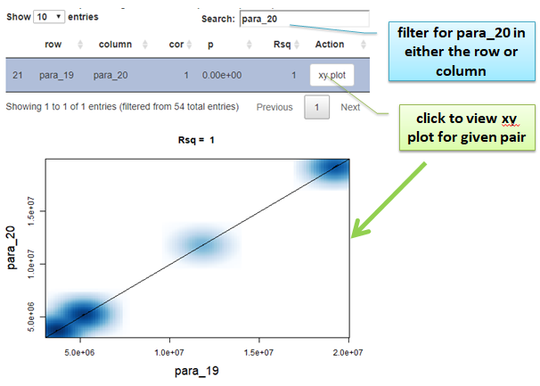

# Background
This post was created using my 2021 Pennsylvania State University (PSU) Stat 485 class project as a way for me as a student to learn R programming language and associated RStudio IDE.  I've copied the code as I created it during the class and re-hosted the app in a new location given that I am no longer a student.

This tutorial will review the source code which generates the Shiny App as demonstrated below.  This simple app provides a user interface to upload a .csv dataset file.  The program will calculate R-squared correlation coefficient values and output sorted values to help the user focus attention on the highly correlating values as a means for dimension reduction of "wide" datasets.

**WARNING: the app may not work if it has hit the monthly usage limit. Try again later if that occurs.**

<iframe height="800" width="100%" frameborder="no" src="https://kljohnson.shinyapps.io/stat485_project-shiny/"> </iframe>

hosted at https://shinyapps.io

# Introduction

I had worked on a project at work using JMP, and I wanted to attempt a similar analysis with R and produce a simple output in an interactive Shiny web page.  The objective of the analysis is to assist a user to find the most highly correlated parameters in a “wide” dataset, so that the analyst can have data-driven discussion with domain experts about the findings; for example identify potential measurement issues or confirm expected results.  

The particular dataset I was working on had over 200 numerical variables per observation, thus a visualization of a correlation matrix for all possible pairs is impractical for identifying the most significant pairs.  Therefore I wanted to develop a tool for which the user could specify a cutoff limit for R-squared and only list the most highly correlated pairs in order of significance.  Note that I chose to use R-squared instead of the correlation coefficient because I was looking for significance in correlation, whether or not it was positive or negative.

Furthermore, since a value like R-squared is of limited value to most domain experts (as most are not well versed in statistical concepts), I also wanted the capability for the analyst to produce an xy plot so that the visualization could demonstrate the finding and assist with the conversation, as well as spot-check that the statistical metric indeed makes sense given the data.
With this approach the outputs are limited to only the significance of interest, as opposed to showing all possible values which may not be interesting and only wastes time and resources to filter out manually.

### Data Source

I decided to allow multiple data sources for demonstration purposes.  The user can select from the built-in “mtcars” dataset, or upload a .csv file of their choosing (in this case I’ve also provided an obfuscated dataset from my work project so that I could compare to my JMP results).

### Source Code and User Guide

This project was easily started within RStudio by creating a new “Shiny Web App”.  I chose to use 2 source code files: ui.R and server.R.  ui.R provides the user interface code, and sets up the “layout” of the graphical objects that the user will interact with.  The ui code below configures 6 Shiny objects:

<figure>

 
<figcaption align = "center">Fig.1 - ui.R source code</figcaption>

</figure>

1. A row with 3 columns
    1.	user selects their dataset (built-in mtcars or user-defined .csv to upload) with “DataSrc”
    2.	numerical input box for the user to specify the desired R-squared lower limit (“Rsq”)
    3.	“xy plot” button.  Once clicked, the analysis will filter based on the user’s input
2. A hidden row which is only required if user selects to upload a.csv file.  
    a.	If user continues with mtcars dataset then this row will remain hidden.  
    b.	Otherwise “csvPath” is used to select the file and “fileSel” is the button to process it
3. “plot” is the area on which the distribution of R-squared values for the entire dataset will be displayed.  This is useful for the user to assist in selecting the desired cutoff value.
4. “txtout” is the html output for a text heading which reflects the user input
5. “table” is where the table of pairs along with correlation coefficient, calculated R-squared, and an interactive button which allows the user to generate the xy plot with a regression fit.
6. “matrix” where the xyplot will be displayed when the user clicks the button for a given row in the output table

### Running the App

**Option A)** During development, run the application locally from within RStudio using “Run App”.  Select “Run External” to view in a web browser which will render the output correctly (I found some features did not work within R window but worked when viewed with Chrome).

<figure>

 
<figcaption align = "center">Fig.2 - Running the app within RStudio</figcaption>

</figure>

**Option B)** Use the provided web service so to avoid having to download and install any R packages (refer to Deployment).

### Responding to User Input

The R-code uses “reactive logic” as explained in the diagram below to handle actions upon a user clicking a button or changing an input.  (Full code is in the appendix).

<figure>

 
<figcaption align = "center">Fig.3 - server.R reactive logic for user selection of the data source</figcaption>

</figure>

### Selecting Data

The user can choose to run the demo with the built-in dataset of “mtcars”, or can choose to upload their own .csv file (WARNING: User must select a valid file or app may crash)
Upon selecting the dataset, the R-code will perform data cleansing like removing NA and variables with only a single value, which was necessary for my custom file.

 

### Perform Analysis

When the user presses this button 2 reactive events are programmed:

1.	A title below the histogram is updated to reflect the user-defined R-squared minimum cutoff value
2.	The table is populated with pairs of variables that are greater than or equal to the R-squared input value provided by the user. For my custom dataset, there were 1128 possible pairs with a large bucket of correlated variables, so I chose a larger filter value of 1.0, and resulted in 54 remaining pairs!

<figure>

 
<figcaption align = "center">Fig.6 - reactive source code for the "xy plot" button</figcaption>

</figure>

The R-code initially populates the table with Rsq ordered in descending order, but the user can re-order by any column by clicking the corresponding “up” or “down” arrow to the right of the column name.  The built-in Shiny table also limits the output to a maximum of 10 entries, which the user can navigate with the controls below the table, or change the max with the drop-down box control above the table.

The user will see only the histogram plot of all R-squared values, and the rest of the output awaits the user to update the R-squared limit and click the “Perform Analysis” button.  

<figure>

 
<figcaption align = "center">Fig.7 - UI Performing the Analysis</figcaption>

</figure>

table column descriptions:

*	“row” and “column” indicate the parameter names for the correlation pair
*	“cor” is the correlation coefficient (signed value)
*	“p” is the p-value for the significance of the correlation
*	“Rsq” is the R-squared value (unsigned, and default to sorted in descending order
*	“xy plot” is a button that the user can click to view the xy plot for that pair of variables 

<figure>

 
<figcaption align = "center">Fig.8 - Second output after clicking "Perform Analysis" button</figcaption>

</figure>

I grew to appreciate the Shiny table’s “Search” feature, which allowed me to retain a rather large list of results by lowering the Rsq limit to say 0.75, and then search for a specific parameter name as shown below.  I think this is a useful feature when interacting with domain experts who may want to explore specific parameters.

After clicking any of the “xy plot” button for a given row ,the xy plot will be displayed below.  The code adds the Rsq to the main title based on the value from the selected row.

<figure>

 
<figcaption align = "center">Fig.9 - Third output after clicking "xy plot" button</figcaption>

</figure>

### Deployment
I spent a bit of time investigating deployment options and eventually found shinyapps.io, which has a free service offering that caps at 25 hours of app usage per month.  I felt this would be sufficient for the class demonstration.  I configured a timeout of 6 minutes in hopes that this limit will not be exceeded while people are running the demo.  If it does, the app will cease to work until the next month.

### Conclusion
Getting up and running with Shiny was surprisingly easy.  Even though I have many years of experience in software programming, I have had only limited exposure to GUI programming, and no experience with web apps, and much of the semantics were new to me.  Nonetheless, within several hours and using the built-in “mtcars” dataset I had a basic implementation of this application which I was happy with.  After that, I simply switched the dataset for the .csv file of my choosing and added some logic for data cleansing.

Overall I was pleased with the interactivity and functionality that can be created in R by using just a few features (i.e. plot, text, button, and data table components). I was happily surprised by the features that came with Shiny’s data table (DT library).  The search and ordering features were a pleasant surprise and provided a usability feature beyond that from what I got from my original JMP based implementation.  With this feature, the value added by allowing the user to provide an R-squared limit for filtering in the first place was diminished.  However I retained this feature for demonstration purposes anyway.

Of course there are many more complex capabilities that Shiny provides, but it is not necessary to go to the extremes in order to develop a useful application in a short amount of time.   I found this a fairly low barrier to entry for both me as the programmer as well as the end-user.  This is in contrast to and end-user needing to install and interact with a desktop application like JMP which requires another license and specific training on that application.  

I was also pleasantly surprised about how easy it was to deploy to Shiny.io’s server.  With a few clicks I had my web app available online!  This is in contrast to the hours I spent reading up on how to create my own server which seemed to be quite more complex of a task to host my own apps.  However there are obvious limitations and the associated costs can grow as your use-case scope and complexity increases.

In closing, creating web apps with Shiny is a great way to provide end-users with a way to access and interact with their data without requiring them to install special software, or know how to code.  I am really excited at the possibility of unlocking the power of data to the many users who are currently limited by the availability and expertise of programming and analysis tools.

### Appendix

Source code can be found at [https://github.com/kljohnson4good/R-code/tree/main/Shiny-corr-coeff](https://github.com/kljohnson4good/R-code/tree/main/Shiny-corr-coeff)

### References

1. Find out more about building applications with Shiny here:   [http://shiny.rstudio.com/](http://shiny.rstudio.com/)
2. Code to integrate shiny app into this blog obtained from: [https://statsandr.com/blog/how-to-embed-a-shiny-app-in-blogdown/](https://statsandr.com/blog/how-to-embed-a-shiny-app-in-blogdown/)
