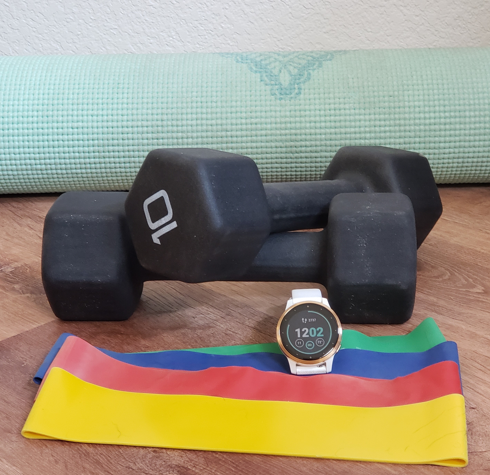

```{r setup, include=FALSE}
knitr::opts_chunk$set(echo = FALSE)
knitr::opts_chunk$set(warning = FALSE, message = FALSE) 
```

<p align="center">
  <font size = 4, color = "Blue">
    What I Learned From My Beachbody Workouts and Fitness Watch Data
  </font>
</p>
<p align="center">
 
</p>

<!--- below style updates the table to use a smaller font for more appealing output format --->

<style>
    th, td { 
      font-size: 16px;
      border-collapse: collapse;
      border-width:3px
    }
    </style>

# Introduction

I was looking for an analysis hobby project to dust off my R programming and data analysis skills after over two years since completing my Master's program.  Thinking about the data I accumulate in my everyday life, I started wondering what my Beachbody online workout data would tell me.  

I began using Beachbody products in 2013 when my husband bought the DVD version of original **P90x** program with instructor **Tony Horton**, which we completed together to prepare for a Mui Thai Kickboxing class.  After that awesome experience, some years later we purchased the **P90x3** DVD which reduced its workout lengths from ~45-60 minutes to a more palatable 30 minutes, which we could commit too with full time engineering jobs.  I was pretty happy with the effectiveness of these workouts and continued to use them intermittently for the next several years.  

It wasn't until 2019 when a friend introduced me to Beachbody On-Demand (**BOD**) that I began to consider branching out my workout experiences.  Then when 2020 hit with COVID-19 and work-from-home, I pulled the trigger and bought the annual subscription, which at $99/yr is quite reasonable compared to a gym membership.  After all, what kind of a price can you put on good health (mental and physical)?

The second addition to my digital workout arsenal came in the form of a **Garmin Vivoactive 4S** fitness watch.  I am usually a tech trend lagger so it was my husband who bought this for me in Christmas 2020.  I started tracking my walking, cycling and Beachbody workouts so I could get a sense of my distance/steps, heart rate and expended calories.

I've been fairly diligent with the workouts since I schedule time on my work calendar to do them every day, but I was terrible at keeping track and didn't record the workouts or synch any data between my watch and the app.  Now, almost 3 years later, I started wondering what my workout history data could tell me.

## Data Sources and Column Descriptions

**Beachbody On-Demand (BOD)**:

BOD does keep a workout history but with several major downsides:

1. The data is not extractable into a worksheet.  To collect my data I had to login into my account, find the history and click each day to manually record the available information, which took about an hour.
2. Some data had to be filled in manually.  For example the instructor information is not within the history, but something I had to pull from the workout description itself.  I also wanted to know when I started and finished a program, which meant that I had to manually code the day number of the program myself.  Lastly I wanted insights into the activity type, so I manually coded the exercise as Yoga, Cardio, Meditation, or Abs.
3. The history only includes the past year's worth of data.  This means that some programs and trends are not able to be adequately represented due to missing data.
4. This manual encoding only has date information and no time-stamp to align the Garmin activity.  This created a few problems when I had done more than one workout in the same day but did not have corresponding watch data for both of them.

Key attributes of the BOD data are:

|Column Name         |Description
|:----------         |:-----------
| *Date              | date of workout (year-month-day)
| Time               | length of workout (minutes)
| Program            | the name of the program
| Instructor         | the main instructor of the program
| Activity.Type      | distinguish yoga from cardio or short abs workouts

**Garmin Watch**:

My watch keeps track of calories, time, max and avg heart rate information.  It also tracks other things but these are the ones I'm interested in for this initial analysis.  Garmin keeps track of workout history and the Connect App conveniently has an extract-to-.csv format feature I ran on my computer.  However the downside was that the watch only saved my workout history for the last 10 months because I had not been syncing my watch to my phone app on a regular basis.  Lesson learned that I need to be doing this more frequently.  

Key attributes of the Garmin watch data are:

|Column Name         |Description
|:------         |:---------------------------------
| *Date              | date of workout (year-month-day hr:min:sec)
| Activity.Type      | Cardio, Cycling, Running, Walking
| Calories           | total calories burned during the workout
| Time               | length of workout (hr:min:sec), converted to minute integers
| Avg.HR             | average heart rate (bpm)
| Max.HR             | maximum heart rate (bpm)

*Date is a key column used to merge/combine the two datasets.  Note that time is removed from the watch data so alignment is on day only.

The combined dataset between BOD and Garmin will filter to only Activity Type of 'Cardio', which is what I use when setting up activity tracking on my watch.  I don't usually turn on tracking for yoga or abs workout types so that data is not available to correlate.

## Data Quality

Deriving an accurate dataset involved quite a few manual steps and fixing various issues.  

**User Error**:

* At times I will start an activity tracking on my watch and forget to turn it off, which then forces me to discard the whole record. This will cause records to show up on BOD with no associated watch data.
* Activities where I forget to turn the watch activity tracking on, or forget to put the watch on all together.  
* Activities which start but get paused after only recording a few minutes of time and I forget to unpause again.  Thus the calories indicate by the watch data are significantly misrepresenting the actual workout length from BOD.

These issues will result in missing data and potentially erroneous data.  Therefore, any conclusions will have to keep that in mind and may require an iterative process of the user (me) to review the results and correct as I discover them.

**Multiple workouts in one day**: 

The datasets are joined by date, without the datetime stamp.  Therefore invalid data may be the result of combining datasets with one or more entry per day in either BOD or Garmin.  In those cases, joining datasets may not know how to align due to lack of timestamp to assist in aligning them.  These could be cleaned manually by making some intuitive inferences.

**Vacation and Sick time**:

There are some weeks with zero workouts, which I assume are due to sick or vacation.  For weeks with low number of workouts it could be due to coming off of vacation or sick time, so the average number of workouts per week could be slightly skewed to the low side.

## Software Prerequisites
1. R lanugauge, R-Studio IDE
2. R packages: ggplot2, dplyr, agricolae
```{r}
     # install.packages("ggplot2")
    library(ggplot2)
    #install.packages("dplyr")
    library(dplyr)
```

# Analysis High Level Summary

```{r}
#Read the data file in .csv format and convert Date column data type to datetime:

data <- read.csv(file = "C:/Users/17077/Documents/Health/Beachbody Workouts.csv") #Beachbody On-Demand (BOD)
# remove BOD rows without an instructor
data <- data[-which(data$Instructor == ""), ]

# convert the Date column to the datetime data type
data$Date <- as.Date(data$Date, "%m/%d/%Y")
#data$Date <- format(data$Date,"%m/%d/%Y") # this changes it to a character
# rename the column 'Time..m.' to just 'Time' to make the code simpler
names(data)[names(data) == 'Time..m.'] <- 'Time'

```


```{r}
# read in the garmin file
garmin <- read.csv(file = "C:/Users/17077/Documents/Health/Garmin_Activities.csv")
garmin$Calories <- strtoi(garmin$Calories)
names(garmin)[names(garmin) == 'Time'] <- 'Time.garmin'
garmin$Timediff <- round(as.numeric(as.difftime(garmin$Time.garmin, format = "%H:%M:%S")),1) # 	00:32:36

# only keep garmin data with activity type set to Cardio because those will be the ones that align to the BOD activities
dt_cardio <- garmin[which(garmin$Activity.Type == "Cardio"), c("Date", "Calories", "Avg.HR", "Max.HR", "Timediff")]
# convert the Date field type to be recognized as datetime data type, remove the time since we don't care about that
dt_cardio$Date <- as.Date(dt_cardio$Date, "%Y-%m-%d %H:%M:%S") # 2022-09-09 12:30:39
dt_cardio$Date <- format(dt_cardio$Date,"%m/%d/%Y") # converts back to a string
dt_cardio$Date <- as.Date(dt_cardio$Date, "%m/%d/%Y")

# inner join the two datasets based on date
dt_comb <- merge(dt_cardio, data[,c("Date","Program","Workout", "Description","Instructor", "Time", "Activity.Type")], by = "Date", all = TRUE) # outer join
# remove missing values that have BOD data by no watch data or vice versa
dt_comb <- na.omit(dt_comb, cols=c("Calories", "Program"))
dt_comb <- dt_comb[which(dt_comb$Activity.Type == "Cardio"),] # filter only to the cardio programs for this analysis
#dt_comb

dt_wk <- data %>% group_by(Year, Week) %>% summarize(workout_cnt = n()) # pivot by year and week to estimate the average number of workouts per week
avg_workout_per_week <- round(mean(dt_wk$workout_cnt),1)

# compute average calories burned per minute
dt_comb$cal_per_min = dt_comb$Calories / dt_comb$Timediff # both time and calories from the watch
avg_cal_per_min <- round(mean(dt_comb$cal_per_min),1)

```

```{r}

# how many overall workouts did I do in the past year?
total_workouts <- nrow(data) # total number of workouts is equal to the total number of rows

# how many overall hours is this?
total_time = sum(data$Time)
total_time_h = round(total_time / 60,1)
num_progs = length(unique(data$Program))
num_inst = length(unique(data$Instructor))
date_start_bod <- min(data$Date)
date_stop_bod <- max(data$Date)
bod_cals <- sum(dt_comb$Calories)
bod_lbs <- round(bod_cals/3500,0)

total_workouts_tracked <- nrow(dt_comb)
max_hr <- round(mean(dt_comb$Max.HR),0)
avg_hr <- round(mean(dt_comb$Avg.HR),0) # closest whole number
date_start <- min(dt_comb$Date)
date_stop <- max(dt_comb$Date)
```

<font size = 5, color = "black">
From `r format(date_start_bod,"%m/%d/%Y")` to `r format(date_stop_bod,"%m/%d/%Y")`:
</font>
<font size = 5, color = "red">

|BOD Summary          |                        |
|:------------------  | ---------------------------- |
| Total Calories:           | `r bod_cals` (~ `r bod_lbs` lbs @3500 cals per lb)          |
| Total #Workouts: | `r total_workouts`     |
| Total Time:               | `r total_time` min (`r total_time_h` hrs) |
| Avg #Workouts per week:   | `r avg_workout_per_week`                  |
| Variety of Experiences:   | `r num_inst` instructors over `r num_progs` different programs |
</font>

<font size = 5, color = "black">
From `r format(date_start,"%m/%d/%Y")` to `r format(date_stop,"%m/%d/%Y")`:
</font>
<font size = 5, color = "red">

|BOD with Watch Data |                        |
|:------------------  | ---------------------------- |
| Total #Workouts:     | `r total_workouts_tracked`         |
| Heart rate:                | `r max_hr` (avg max), `r avg_hr` (overall avg) |
| calories burned per min:   | `r avg_cal_per_min` (avg)          |

</font>

### Mismatch of Recorded Time

Compare BOD time to watch time to understand how aligned the recorded calorie and HR data from the watch are to the completed workout.  Values not within about 10 minutes of each other indicate an integrity issue. 

To work around that problem, the analysis will calculate calories-per-minute using the watch time only, so that it is a relative number.  Note then that <font color="red">the total calories reported by the watch is less than the true value of calories burned during the BOD workouts</font>.

```{r}
# look for inconsistencies between BOD Time and garmin's recorded Timediff
# add blue reference lines around +/- 10 minute
dt_comb %>% ggplot(aes(x = Time, y = Timediff)) + geom_point() + labs(x = "BOD time", y = "Garmin Time", title = "Garmin vs BOD workout length") +geom_abline(slope = 1, intercept = 1, color="grey") +  geom_abline(slope = 1, intercept = 10, color="blue", style="dashed") + geom_abline(slope = 1, intercept = -10, color="blue", style = "dashed")

```

This graph shows 5 workouts recorded by the watch with times below 10 minutes, likely a result of user error previously mentioned.

## Beachbody Activity Types

My Beachbody workouts were categorized into 3 activity types: Yoga, Cardio and Abs.  I wanted to know what percentage of my workouts were yoga versus cardio.

```{r}
# visualize what percent of the workouts are Cardio vs Yoga
activity_type <- data %>% group_by(Activity.Type) %>% summarize(workout_cnt = n())
# calculate as a percent (proportion)
activity_type$prop = round(100*(activity_type$workout_cnt/sum(activity_type$workout_cnt)),0)

# Compute the position of labels
activity_type <- activity_type %>% 
  arrange(workout_cnt) %>%
  mutate(ypos = cumsum(prop)- 0.1*prop )

ggplot(activity_type, aes(x="", y=workout_cnt, fill=Activity.Type)) + geom_bar(stat="identity", width=1, color="white") + coord_polar("y", start=0) + theme_void() + geom_text(aes(y = ypos, label = paste(prop,'%')), color = "black", size=6) + labs(title = "Beachbody On-Demand Activity Type (%)") 


```
  
<font size = 5 color = "red">About a quarter of my workouts are yoga while three quarters focus on cardio.</font>

## Beachbody Instructors

```{r}

sum_inst <- data %>% group_by(Instructor) %>% summarize(workout_cnt = n())
sum_inst <- sum_inst[order(sum_inst$workout_cnt, decreasing = TRUE),] # order descending
# calculate a new column as the percent of total workouts
sum_inst$workout_pct = round(100*(sum_inst$workout_cnt/sum(sum_inst$workout_cnt)),0)
names(sum_inst)[names(sum_inst) == 'workout_cnt'] <- 'instructor_cnt' # rename to instructor count

```
 


```{r}
# try the bar chart again but use a stacked viz to show the activty type per instructor
dt_inst_act <- data %>% group_by(Instructor, Activity.Type) %>% summarize(workout_cnt = n())
dt_inst_act <- dt_inst_act[order(dt_inst_act$workout_cnt, decreasing = TRUE),] # order decending by workout total count
# calculate a new column as the percent of total workouts
dt_inst_act$workout_pct = round(100*(dt_inst_act$workout_cnt/sum(dt_inst_act$workout_cnt)),0)

dt_comb2 = merge(dt_inst_act, sum_inst[,c("Instructor","instructor_cnt")], by="Instructor")

#dt_comb2
# plot the bar chart ordered by value so that the instructor with the most workouts is listed first and so on
#dt_comb2 %>% ggplot(aes(x=fct_reorder(Instructor, instructor_cnt), y = workout_pct, fill = Activity.Type)) + geom_col(position="stack") +  #coord_flip() + labs(y = "% Workouts", x = "Instructor", title = "Workouts by Instructor") + geom_text(aes(Instructor, instructor_cnt, #label=instructor_cnt, fill=NULL), data = sum_inst)

# plot the x-axis using the workout percent of total, but label with the absolute number to put into context
ggplot(dt_comb2, aes(reorder(Instructor, instructor_cnt, sum), workout_pct, fill = Activity.Type)) +
  geom_col() +
  geom_text(
    aes(label = instructor_cnt, group = Instructor), 
    stat = 'summary', fun = sum, vjust = 0, hjust=-.2) + coord_flip() +  labs(y = "% Workouts", x = "Instructor", title = "Workouts by Instructor")

```  
  
<font size=5 color="red">Autumn is clearly my favorite instructor.  I've done 84 of her workouts (>50% of the total workouts), while Tony Horton comes in second at 34 workouts(>20% of the total workouts).  However clearly Tony has been my go-to yoga instructor!</font>

## How Long Is Each Workout?

```{r}
# histogram with 5 minute bin sizes
ggplot(data, aes(x=Time)) + geom_histogram(binwidth=5, color="black", fill = "steelblue") + geom_vline(aes(xintercept=median(Time)),
            color="red", linetype="dashed", size=1) + labs(x = "workout length (min)", title = "Distribution of BOD Workout Length")

#plot(data$Date, data$Time, cex = 0.9, xaxt = "n", color=data$Activity.Type)
# change the data label format for the Date x-axis
#axis(1, data$Date, format(data$Date, "%d-%m-%y"))

# calculate the median time
time_med = median(data$Time)

data %>% ggplot(aes(Date, Time, color=Activity.Type)) + geom_point() + geom_hline(yintercept = time_med, color="red", linetype="dashed", size=1) + labs(y = "workout length (min)", title = paste("Workout Length by Date (median = ",time_med," min)"))

```

<font size=5 color="red">I've been consistently completing ~ 30 minute workouts</font>

The typical (median) workout length is 30 minutes.  The higher values on the left-hand side were due to ending a previous program (80-Day Obsession) which had workouts between 30-60 minutes.  

## Which Day do I prefer Working Out?

```{r}

data$weekday <- weekdays(data$Date)
dt_week <- data %>% group_by(weekday, Day.Of.Week) %>% summarize(workout_cnt = n())

ggplot(data=dt_week, aes(x=reorder(weekday, Day.Of.Week), y=workout_cnt)) + geom_bar(stat="identity") + labs(x = "Day of Week", y = "#workouts", title = "Workouts by Day of Week")

```

<font color="red" size=5>Most preferred days to workout are Monday-Thursday.  Least preferred day is Saturday when I tend to do non-BOD activities</font>

## Program Variety

Questions answered:

1. Which Beachbody programs have I tried?
2. Which program(s) do I keep coming back to?

```{css, echo=FALSE}
.scroll-100 {
  max-height: 200px;
  overflow-y: auto;
  background-color: inherit;
  font-size: 12px;
  border-top: 1px solid #666;
  border-bottom: 1px solid #666;
}
```

```{r, class.output = "scroll-100"}
#library(kableExtra)
# visualize what percent of the workouts are Cardio vs Yoga
dt_pgm <- data %>% group_by(Program, Instructor) %>% summarize(workout_cnt = n())
# calculate as a percent (proportion)
dt_pgm$prop = round(100*(dt_pgm$workout_cnt/sum(dt_pgm$workout_cnt)),0)
#sort in descending order
ggplot(dt_pgm, aes(x=workout_cnt)) + geom_histogram(binwidth=1, color="black", fill = "steelblue") + labs(x = "Program count", title = "Distribution Workouts by Program")
print(knitr::kable(dt_pgm[order(-dt_pgm$workout_cnt),]))
```

<font color="red" size=5>The past year has been dominated by the '9 Week Control Freak' program by instructor Autumn Calabrese.  That program has 45 total workouts (5 workouts per week x 3 phases x 3 weeks per phase).  Since I've done 69 from that program, it shows that I completed it once and started doing it again.</font>

### Calories vs Heart Rate

Questions to answer:

1. What is the correlation of rate of calories burned versus the average heart rate during the workout?
2. Quantify the calories burned per minute versus the average heart rate to associate the payoff to the effort.

```{r}
ggplot(dt_comb, aes(x=Program, y = Avg.HR)) + geom_boxplot() + coord_flip() + labs(title = "Average Heart rate by Program")

#ggplot(dt_comb, aes(x=Program, y = cal_per_min)) + geom_boxplot() + coord_flip() + labs(title = "Average Calories Burned per Minute by Program")


#lm_fit <- lm(Avg.HR ~ cal_per_min , data=dt_comb) # regression fit equation
lm_fit <- lm(cal_per_min ~ Avg.HR , data=dt_comb) # regression fit equation
r2 <- round(summary(lm_fit)$r.squared,2)
slope = round(coef(lm_fit)[["Avg.HR"]] * 10,1) 
#fit_line <- data.frame(pred = predict(cal_fit = predict(lm_fit, dt_comb))
# attributes(summary(lm_fit))

annotations <- data.frame(
   xpos = c(-Inf, -Inf),
   ypos =  c(Inf, Inf),
   annotateText = c(paste("fit line slope: ", slope ," more calories for additional 10 bpm"),
                    paste("fit line R-squared:", r2)),
   hjustvar = c(0,0) ,
   vjustvar = c(1,3))

# display calories by average heartrate
dt_comb %>% ggplot(aes(x = Avg.HR, y = cal_per_min)) + geom_point() + labs(x = "Avg.HR (bpm)", y = "calories per minute", title = "Calories burned per min vs Avg Heart rate") + geom_smooth(method="lm", se = FALSE) +
  geom_text(data = annotations, aes(x=xpos,y=ypos,hjust=hjustvar,
                vjust=vjustvar,label=annotateText)) + scale_y_continuous(breaks = seq(0, 100, by = 1), minor_breaks = seq(0,0,0))

```
This two-way plot shows a pretty strong correlation between average heart rate and calories burned per minute.  This data supports a fairly basic intuition that higher effort (higher BPM) will result in more calories burned.  But note that this calculation provides an actual number. 

<font size=5 color="red">An extra 1.2 calories per minute can be burned by increasing heart rate by 10 bpm.</font>


### Does Avg.HR Differ by Program?

Run a one-way ANOVA to test for significance of Avg.HR by Program.  Then a Tukey test will do a simultaneous comparison to group the programs by Avg.HR so that I can visualize which programs produce a similar level of effort.


```{r}
library(agricolae)
anova <- aov(Avg.HR ~ Program, data = dt_comb)
#summary(anova)
# resource: https://r-graph-gallery.com/84-tukey-test.html
#tukey = TukeyHSD(x=anova, conf.level = 0.95)
#tukey

# agricolae library
# resource: https://rpubs.com/aaronsc32/post-hoc-analysis-tukey
tukey <- HSD.test(anova, trt='Program', alpha=0.06) # 0.05 alpha seemed too selective, grouping too many in 'ab'
#tukey

# vlookup the group assignment to the program
#boxplot(dt_comb$Avg.HR ~ dt_comb$Program , ylim=c(min(dt_comb$Avg.HR) , 1.1*max(dt_comb$Avg.HR)) , ylab="value" , main="") + coord_flip()
# col=my_colors[as.numeric(LABELS[,1])]

# Reference: http://rfunction.com/archives/1302
#ggplot(dt_comb, aes(x=Program, y = Avg.HR)) + geom_boxplot() + coord_flip() + labs(title = "Average HR by Program")
par(mar=c(5,12,4,1)+0.1, mpg=c(10,1,0)) # widen margin to fit program name labels mar=c(bottom, left, top, and right. )
# mpg=c((i.e. xlab and ylab in plot), the second the tick-mark labels, and third the tick marks.)
plot(tukey, horiz=TRUE, las=1) # las = 1 for horizontal tick mark labels
title( xlab="Avg.HR")
 
```

<font color="red" size=5>Programs which give me the highest average heart rate (and hence more calories burned per minute) are Focus T25, Morning Meltdown 100, P90x3, JYBW, Barre Blend and 9 Week Control Freak.  I only tried one workout from '4 Weeks for Every Body' program so far, but it's seems to take much less effort than the other programs</font>

### Which workouts get my heart rate the highest?

The table below shows the workout description in order of the maximum Avg.HR I was able to achieve.  (I used max instead of mean to avoid skew which could appear in results due to workouts I had done fewer times than others).

For the most efficient calorie burn, I should return to 9 Week Control Freak's Tabata Cardio workout.  I also know I enjoy a good low-impact workout to take it easier on my aging joints, so this table shows that Barre Blend's Cardio Blend is not far down the list.

```{r, class.output = "scroll-100"}
# which workout, regardless of program, has the highest average heart rate?
dt_hr_by_wko <- dt_comb %>% group_by(Program, Description) %>% summarize(avg_hr = max(Avg.HR)) 
#dt_hr_by_wko <- dt_hr_by_wko[order(dt_hr_by_wko$avg_hr, decreasing = TRUE),]
print(knitr::kable(dt_hr_by_wko[order(-dt_hr_by_wko$avg_hr),]))
```

# Conclusion: What Did I Learn and How Will I Behave Differently?

This analysis exposed what a lazy fitness tracker user I am.  Even though apps like BOD have a tracking mechanism, I don't follow through with logging because it involves additional app button clicks that tend to annoy me.  I will make an effort to do better along with hoping that the technology improves.  I will also take the time to synch my Garmin watch data to the app more often to avoid losing the history.

I was proud of myself to see the consistency of workouts for the last 12 months, but somewhat surprised to see how few pounds worth of calories I had actually burned from the Beachbody workouts (only 6 pounds).  However it was motivating to see data that supports the additional calories per minute I can burn if I up my effort and get my heart rate up for longer periods of time.  I also appreciated the data that supported my intuition about which programs are more effective than others for heart rate and effective calorie burning.  Now that I've seen the data, I'll definitely be sprinkling the 9 Week Control Freak Tabata Cardio more often into my routine.  

The only disappointment I encountered through this process was the difficulty to extract the Beachbody data from the app and being limited by data beyond a year ago.  I was really hoping to compare complete programs like Barre Blend and 80 Day Obsession which were completed over a year ago.

The analysis enabled me to realize how technological feature advancement in smart watches could improve the quality of the data and open doors for more insights.  For example the ability to connect directly to online programs like BOD could enable users to easily associate calories and heart rate to specific programs and workouts. This could be coupled with automated social posts when users hit achievements like total calories burned or beat personal records for max avg heart rate.

From this analysis I'm glad I learned how to enable my smart watch to auto-start and auto-stop activities which I hope will improve my partial and missing calories and heart rate data.  Before this analysis I didn't realize the impact that my user-errors would have on the analytics.

I look forward to the future of fitness watches and automated activity tracking capabilities, and I hope there will be more synergy with online workout programs to bring fitness tips and insights to users like myself.

# Appendix

* Link to source code: [index.RMD](https://github.com/kljohnson4good/Blog/blob/main/content/post/2022-09-12-analyzing-my-beachbody-workout-and-smart-watch-data-with-r/index.Rmd)
* .csv data files can be found  [here](https://github.com/kljohnson4good/R-code/tree/main/R-analysis-of-beachbody-workout-and-smart-watch-data)

### Full Tukey Analysis

```{r}
tukey
```