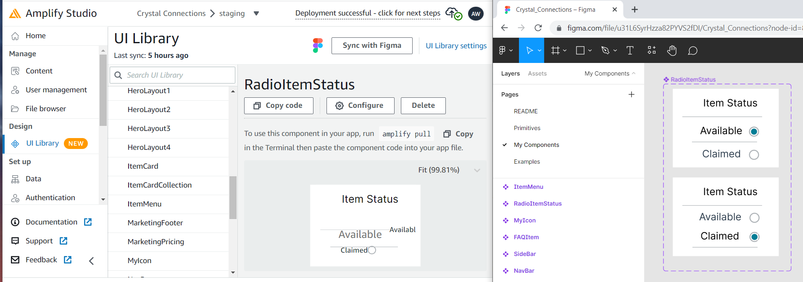
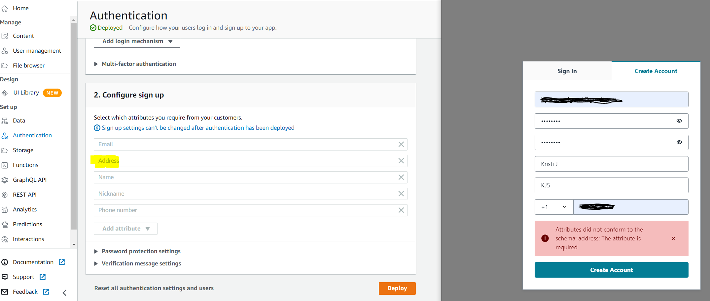

# The Most Important Skill To Build My First Web App

It's been 1 week into my new challenge to build a full stack web application.  Although I have extensive programming experience with languages such as python and c++, I'm fairly new into the realm of web or phone apps which requires front-end and back-end development, plus hosting platforms and data storage services to stitch together.  Getting started has been much tougher than I expected!

[Angela Duckworth](https://angeladuckworth.com/grit-book/) was correct.  Her book **[Grit](https://angeladuckworth.com/grit-book/)** shares insights about why some people succeed and others fail.  She attributes the secret to a special blend of passion and persistence she calls "grit".  (Summarized in this [TED Talk](https://www.youtube.com/watch?v=H14bBuluwB8) video).

After my first week, I'm 100% in agreement with Angela's assessment!  I've hit roadblock after roadblock and have encountered endless frustrations, and let me just say that I *hate* being frustrated!  It's my kryptonite, and the major cause of my snacking habit because eating distracts me from those annoying feelings.  I've probably wanted to give up and quit at least 10 times so far.  

Fortunately, after taking a short break after each frustration episode, I've been able to convince myself to adjust my attitude and dive right back in.  This article attempts to share the types of roadblocks and frustrations that I have encountered as a means to vent and perhaps help other developers feel like they have some company in their misery.

## Choose A Coding Language

The first decision I had to make to build my app is a coding language.  The language will determine what hardware the user will need to use your app.  For example Apple iOS phone app, Android phone app, or generic web app that can be run through a web browser like Chrome.  

The language choice may also incur feature limitations.  For example, a cross-platform development choice such as **Flutter** may not be able to take advantage of specific hardware features in an Apple or Android phone because it may support both.  However, cross-platform development languages come with reduced development costs since you can share a code-base and support multiple devices.

There are several choices for creating web applications, and it can be difficult for example to understand the implications between similar sounding terms like **React** and **React Native**, so it will require some initial research even before getting started with any hands-on development.  Other language choices include **JavaScript**, **Python**, **Java**, **C#**, **PHP**, **Perl**, **Ruby** etc.  

## What Does Full-Stack Development Entail?

The **Front-End** is the user interface (UI) that displays all the pretty, clickable components that appear on our screens.  The **Back-End** is the logic that runs behind the scenes to turn user requests into some kind of logical response, and then update the user interface.  Both environments are very different to develop, and can be achieved through different means.  

Since my objective was to get going quickly, I searched for something that appeared to provide drag-and-drop, off-the-shelf-components that I could then stitch together with minimal coding wizardry.  For that reason, I chose **AWS Amplify** as a platform to stitch the end-to-end app together.  This platform is created by Amazon, so I figured it would be robust and less susceptible to going out-of-business and leaving my poor app to die.  This platform requires signing up for an account, providing a credit card, and has a small learning curve.

Amplify advertised its integration with another platform called **Figma** which is used to create the artistic, graphical components of the UI.  This was yet another service to sign up for and learn.

## Front-End Is Way Different From Back-End

I ended up choosing Javascript for the front-end development, and learning that has been a challenge.  Sure, I could have spent more time learning from the beginning, but I don't have that kind of time right now.  Let me just say that for those with c++ or python backgrounds, jumping into JavaScript coding for the front-end development may pose a challenge, unless you're already comfortable with developing event-based programming models and styling GUIs with css and html.

## Every Rose Has It's Thorn

Thanks Jon Bon jovi.  Yes, every piece of software that's required for end-to-end development has its own learning curve and quirks.  Oh, simply commit and push your code to git?  Hello authentication roadblock!

## Tutorials Are Only Part Of The Answer

While there are many tutorials by many authors to be found, unfortunately many explain similar steps and don't quite cover the full set of functionality to get your app working the way you want it.  Sadly, some tutorials that come with the AWS Amplify help documentation don't even include sufficient detail for new people to complete them.  I believe the writers assume more knowledge than I possess.

Other tutorials I found were out-of-date and the screenshots or menu items had changed such that it can became difficult to follow. As a novice, I had to leverage multiple tutorials to piece together the entire picture.  Success also required deleting projects and restarting from the beginning 3 times until I could finally complete my first tutorial all the way through.

## Common Components Don't Come Out-Of-The-Box

Simple elements like radio buttons, drop-down lists, or hamburger menu items are pretty common these days.  My past experience with Microsoft Visual Studio has these off-the-shelf components ready to easily integrate, so I assumed I'd find something similar in the web app world.  I was wrong!

In Figma, I was shocked to learn that these elements had to be built frame-by-frame, and connected together with spaghetti-like state transitions!  OK, OK, I'll do it.  I sat there and did it, and was pretty proud of myself.  It worked great when I tested it within Figma.  

## Features Don't Work As Expected

My first do-over project was to switch from using React-Native to just React, which meant goodbye to phone app functionality.  I could live without that for now, but I was a little annoyed because it turns out my choice of using AWS Amplify doesn't fully support React-Native even though it advertises as so.  For example, none of the ui-components from Figma would import.  No error or warning was given during the import sync, but the software simply proceeded to do nothing but give an error during compilation time.  Finally after some Googling around I was able to infer the root cause from another frustrated user.

After 3 days I could have a minor celebration after completing my first tutorial.  I had successfully deployed some version of an app to the web, and even connected it through a version control system, GitHub.  I thought I was really rolling now.  

I was picking up the pace at developing my own UI elements in Figma, and even got some radio buttons and menu transitions working.  However, when I imported to AWS Amplify, I discovered that transitions and animations don't work.  Further more, some elements don't even render properly.  For example I built a hamburger menu item, which is just 3 horizontal lines depicting that a drop-down menu is present upon click, but it rendered as just an empty box with no lines.  Other hand-built items in Figma were rendered very distorted, with lines shifted vertically and/or horizontally.

This picture shows the correctly generated element in Figma on the right, and the distorted view of the item after importing into Amplify.

  

Another issue was using the Autenentication feature of Amplify which added a required Address, however didn't render the form with the field and put the user into a state of impossible login as shown below.

  

# Conclusion: It's Ugly

If I had allowed myself more time, I may have started learning web development from the beginning, similar to how structured classes are taught.  This probably would have saved a lot of frustration.  However my goal is to create an MVP (Minimum Viable Product) quickly and get to rapid prototyping.  I don't want to spend months going through all the background that is probably required.

Throughout this process I've discovered that several of my initial assumptions were wrong.  I assumed that the modern web development ecosystem would included free off-the-shelf components that I could easily integrate.  Maybe there is and I just haven't found it yet.  By my experience so far has been a lot more manual piece-mealing and stitching than I originally thought would be required.

So, after one week, I've got an ugly skeleton of an app deployed and a lot more frustration and grit to look forward to in my future.
