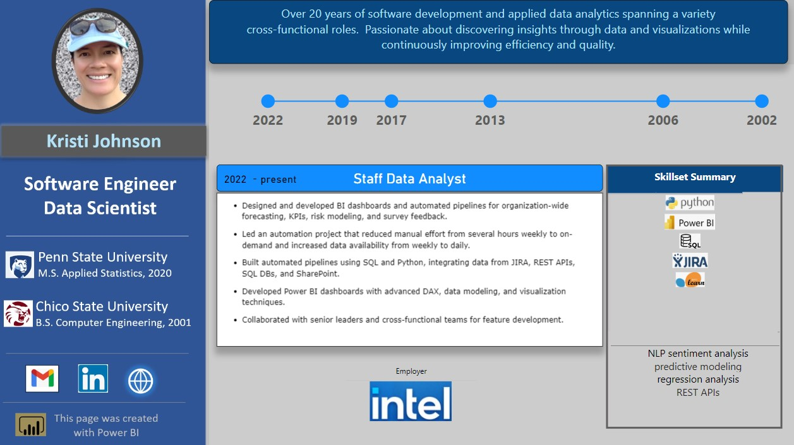
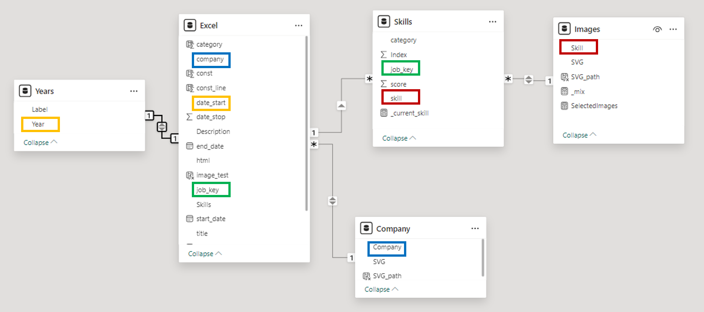

# Introduction

I was looking for fun project to demonstrate Power BI interactive visualizations and decided to create my resume and host it within this blog site.

# Live Dashboard
click the button to sign in to Power BI to view.
May require changing to Desktop view if on a mobile device.

<iframe title="PowerBI_Resume" width="1140" height="541.25" src="https://app.powerbi.com/reportEmbed?reportId=47f05259-f820-46c0-9508-d9c1e5f96c89&autoAuth=true&ctid=fa157908-e648-4ecd-9aa6-3ee1669fff5e" frameborder="0" allowFullScreen="true"></iframe>

# Under The Hood

If you don't have a Power BI account and therefore can't see the interactive dashboard above, it should look like this:

 
  image 1. Dashboard Screenshot

## The Layout
I leveraged a popular method for designing dashboards by first laying out the images and components in PowerPoint.  A free screenshot snippet tool was used to capture and save the template as an image which was then imported into Power BI and used as the canvas background.

# Dynamic Components
With the visual element design in place, it was now time to design the interactive elements of the dashboard.  The requirements were:

  1. Active links to my personal website and Linked-In profile.  
  2. Clicking a time period on the line chart updates the description and skills.
  3. Some Skills shown as images and others shown as text.
  
## The Data Model

Several tables with relationships could be used for the data and an Excel spreadsheet works perfectly for holding a collection of small tables (each tab represents a table).

  1. <b>Jobs</b> - job code, start/end year, title and description.
  2. <b>Company</b> per job - map company name to SVG image.
  3. <b>Skills</b> per job - map job code to skill.  Score column enables ordering by expertise. 
  4. <b>Images</b> per skill - map skill names to SVG images.
  5. <b>Date Table</b> - used to appropriately space the line chart relative to the start date of the role.  (This table is generated within PowerBI and does not need to be explicitly defined in the Excel file).
  

 
  image 2. Table Relationships

### Experience Timeline
A line chart was used to show the timeline of job roles throughout my career.  This interactive component  will update the skills, employer logo and description when the user clicks on the chart marker.

Although it works well enough, a desired enhancement includes ability to highlight the currently selected region.

### Job Description
I tested displaying the job description text with several elements.  The first attempt used a Card.  This created a single paragraph of center-aligned text.  While it did the job, it did not feel easy to read and was not a great user experience.  

The final display you see uses the html content (light) visual. With this free add-in, an html formatted bulleted list could be generated within the data model and displayed nicely to the user.  The only downside I found with this visual is that I could not re-size the font for the bulleted list.

### Skill set Summary

I wanted a way to make the skills pop out to the user, so what better way than to use dynamic images.  This took a bit more experimentation and idea scouring from the web, but the final product uses a table with images rendered with SVG (Scalable Vector Graphics).  

SVG is text that specifies how to render an image and works great for low-resolution images.  These could be created by finding the image of interest and pasting into PowerPoint.  Then right-click the image and save as .svg format. Open the .svg file using a text editor like notepad and copy the text into the Excel data model.

The downside of using a table to display images is that it is less straight forward to re-size than using something like a button, but the ability for dynamic selection outweighed that trade-off.

### DAX Measures

The default functionality will show all data when no specific marker is selected, which means all descriptions and roles will be displayed.  However, what is actually desired is to show only the latest job description and skills if nothing on the chart is selected.  

This feature was made possible by creating measures in DAX that uses 'calculate' to equal the desired value (title, start/end year, description) for the max year.  When nothing is selected, the max year will be the latest role, and when a marker is selected will be equal to that selected value.

The Skills table uses a similar DAX formula to create a measure that returns 1 if the job key is equal to the minimum value from the related Jobs table (the latest job starts counting at 1).  A filter is then applied to the tables to show only when the value is 1.

# Dashboard Server

A Pro license is required to publish the report to Microsoft's cloud workspace (https://app.powerbi.com/), so I started with the 60-day free trial.  Once available in the cloud, use File -> Embed Report to copy the html iframe code and paste into this blog.

# Summary

A standard resume is typically 1-2 pages, and the best practices indicate to limit to the last 10 years of experiences.  For those like myself with more than 10 years of experience, an interactive dashboard like Power BI can enable users to see the entire time frame at a glance, and focus only the time periods of interest.

<u>Challenges</u>
 
Although Power BI is a free application, one downside is the complexity required to share with others.  When shared using a work or educational organization where viewers have proper licenses, it is fairly easy.  However enabling my individual account to allow a public embed code proved to be much more difficult.  These security measures are the reason users must login before the interactive dashboard can be displayed.

<u>Credits</u>
 
Thanks to Fernan (Jan 4, 2023) "How to create a CV / RESUME as a POWER BI REPORT from START to FINISH" [Video]. You Tube. https://youtu.be/k0JU5YtXv0E?si=qOcuTnzyDtU7Xrs8.